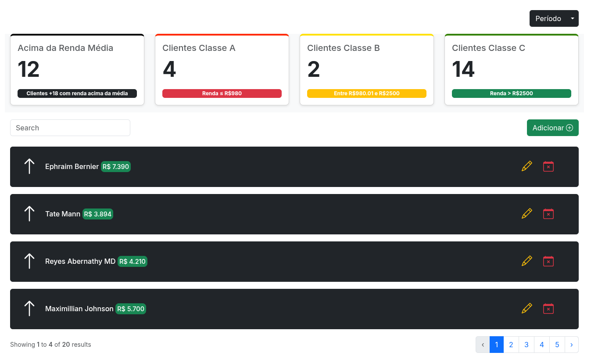

<h1 align="center"> Custom System Admin </h1>

  Aplicação criada para avaliação técnica, focada em organização, boas práticas e uso de Laravel.

  <a href="#tecnologies">Tecnologias</a>&nbsp;&nbsp;&nbsp;|&nbsp;&nbsp;&nbsp;
  <a href="#project">Projeto</a>&nbsp;&nbsp;&nbsp;|&nbsp;&nbsp;&nbsp;
    <a href="#orientations">Orientações</a>&nbsp;&nbsp;&nbsp;|&nbsp;&nbsp;&nbsp;
  <a href="#challenges">Desafios</a>&nbsp;&nbsp;&nbsp;|&nbsp;&nbsp;&nbsp;
  <a href="#extres">Extras</a>&nbsp;&nbsp;&nbsp;|&nbsp;&nbsp;&nbsp;
  <a href="#license">Licença</a>

  

 

  

## 🚀 Tecnologias

 Esse projeto foi desenvolvido com as seguintes tecnologias: 

- HTML e CSS (Bootstrap);
- Laravel;
- Blade;
- PostgreSQL;

## 💻 Projeto

 Este sistema foi desenvolvido como um teste técnico e tem como objetivo apresentar relatórios e informações organizadas em uma interface simples, responsiva e funcional.

## 🗺️ Orientações

 Você precisa ter o NPM e o Composer instalado em sua máquina para instalar as dependências necessárias.

<ul style="margin-left: 20px">
  <li> Execute em seu terminal o comando "composer install" e "npm install" para instalar as dependências do Laravel;</li>
  <li> Execute o comando "php artisan serve" e "npm run dev" para rodar o servidor. </li>
</ul>

## ⚔️ Desafios enfrentados

 Um dos principais desafios foi voltar a utilizar o Laravel puro após um bom tempo trabalhando com outras stacks. Além disso, precisei analisar e decidir qual seria a melhor estrutura para um projeto simples como este, garantindo organização, escalabilidade e clareza no código. Essa experiência foi importante para reforçar boas práticas e retomar a familiaridade com o framework.

## 🧑‍🔧 Extras

 
    Fique a vontade para realizar qualquer tipo de mudança que você desejar.

## :memo: Licença

Esse projeto está sob a licença MIT.